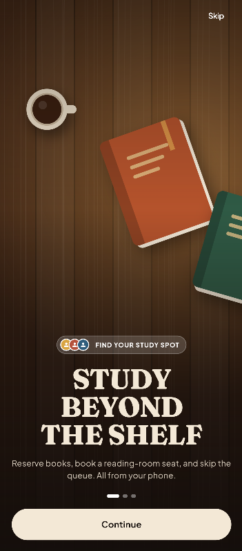
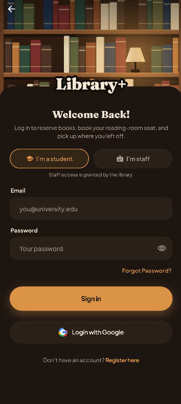

# Library+ (SLIIT BookBench)

A calm, well-run reading room in your pocket — browse the campus catalogue, reserve a
study seat, join waiting lists, and check in with a QR pass.

**Library+** is the Flutter mobile client for the *Library Book Reservation & Reading
Room Seat Booking System* at SLIIT. It is a Material 3 app backed by Firebase
(Auth + Firestore + FCM), with a hand-built warm design system ("warm wood and lamplight"
— amber for actions, rust for what you've chosen, cream paper text) and an honest-UI
policy: estimates are labelled, offline data says so, and no control exists without a
real effect.

---

## Table of contents

1. [Features](#features)
2. [Screenshots](#screenshots)
3. [High-level architecture](#high-level-architecture)
4. [Layer guide](#layer-guide)
   - [Presentation — widgets & screens](#1-presentation--widgets--screens)
   - [State — AppState (ChangeNotifier)](#2-state--appstate-changenotifier)
   - [Data — FirestoreService & mock data](#3-data--firestoreservice--mock-data)
   - [Models](#4-models)
5. [Design system](#design-system)
6. [Motion & 3D animation system](#motion--3d-animation-system)
7. [Navigation model](#navigation-model)
8. [Firebase layout](#firebase-layout)
9. [Screen inventory](#screen-inventory)
10. [Accessibility](#accessibility)
11. [Getting started](#getting-started)
12. [Testing](#testing)
13. [Project structure](#project-structure)
14. [Roadmap & known gaps](#roadmap--known-gaps)

---

## Features

| Area | What you can do |
|------|-----------------|
| **Books** | Live-search the catalogue by title / author / ISBN / category, view real cover art (OpenLibrary) with generated fallback plates, reserve a copy with a pick-up deadline, cancel with an honest consequence dialog |
| **Seats** | Explore a 4×4 seat map per floor (map **or** list mode), filter by zone & facilities, follow the "Top pick" recommendation, pick a date + time slot, reserve — or join the waiting list when a seat is taken, with live in-place conflict handling |
| **Waiting list** | See your queue position, get promoted automatically when a seat frees up ("SEAT OPEN" state), leave a queue with confirmation |
| **QR pass** | A notched *ticket* pass with an always-ink-on-white QR (works offline), tap-to-flip 3D card revealing the booking code, self check-in ("I've arrived") |
| **Active session** | Live elapsed/remaining timer, entitlements (power, Wi-Fi, zone), extend or end the session |
| **Notifications** | Grouped Today/Earlier feed, read state, badge on the Home bell, FCM push |
| **Staff mode** | Staff desk with dispatch queue (approve/dismiss), QR scanner with manual-code fallback, seven-outcome verification screen, check-in / handover confirmation |
| **Account & settings** | Profile + stats, theme picker (system/light/dark), notification preferences, sign out with confirmation |

---

## Screenshots

The signed-out flow: two intro slides, then the sign-in and register sheet. (Images live in `docs/screenshots/`.)

| Intro | Welcome | Sign in |
|:---:|:---:|:---:|
|  |  |  |

More screens (seat map, home, QR pass) can be added the same way.

---

## High-level architecture

```
┌──────────────────────────────────────────────────────────────────────┐
│                            PRESENTATION                              │
│   features/*        Screens as StatelessWidgets, composed from       │
│                     core/widgets (design-system components)          │
│                     + core/widgets/motion3d.dart (3D depth cues)     │
└───────────────▲──────────────────────────────────┬───────────────────┘
                │ watch (rebuild on notify)        │ call intent methods
                │                                  ▼
┌───────────────┴──────────────────────────────────────────────────────┐
│                        STATE (app_state.dart)                        │
│   AppState extends ChangeNotifier — one object per app run,          │
│   provided via AppScope (InheritedNotifier). Holds lists of models,  │
│   subscribes to Firestore streams, seeds from MockData, exposes      │
│   intent methods (reserveSeat, joinWaitlist, checkIn, …) and         │
│   connectivity truth (lastSyncedAt, isHydrated).                     │
└───────────────▲──────────────────────────────────┬───────────────────┘
                │ typed models / snapshots         │ writes (add/update/
                │                                  │ delete / transactions)
┌───────────────┴──────────────────────────────────▼───────────────────┐
│                          DATA (data/firebase)                        │
│   FirestoreService — the ONLY class that touches Firebase.           │
│   Auth · streams per collection · write methods · seat reservation   │
│   as an atomic transaction · waitlist promotion.                     │
│   data/mock — MockData seed (used offline & for first paint).        │
└───────────────▲──────────────────────────────────────────────────────┘
                │
        ┌───────┴────────┐
        │    Firebase    │  Auth (email + Google) · Cloud Firestore
        └────────────────┘  Cloud Messaging (FCM) · local notifications
```

**The one rule:** data flows **down** (Firestore → service → state → widgets) and
intents flow **up** (widget → `AppState` method → service write → snapshot comes back
down). Widgets never import Firebase.

---

## Layer guide

### 1. Presentation — widgets & screens

- `main.dart` — bootstraps Firebase, seeds the catalogue on first run, enables
  edge-to-edge, and runs `LibraryApp`.
- `app.dart` — owns the single `AppState`, keeps the global palette in sync with the
  active brightness, and gates `Splash → Login | AppShell`.
- `core/theme/app_theme.dart` — the entire token system (see
  [Design system](#design-system)): hand-built light/dark `ColorScheme`s
  (never `fromSeed`), `AppColors`, `AppText` (Fraunces display + Plus Jakarta Sans), `AppSpacing`, `AppRadii`,
  `AppGradients` (exactly two: `hero`, `brand`), `AppShadows`, `AppMotion`, and the
  M3 `ThemeData` with component themes.
- `core/widgets/shared_widgets.dart` — the component library: `AppScaffold`,
  `SurfaceCard`, `GradientHero`, `TicketCard` (notched call-slip shape with dashed
  perforation), `QrPassTile` (always ink-on-white), `StatusPill`, `Callout`,
  `EmptyState` / `ErrorState`, `Skeleton` / `SkeletonCard`, `SegmentedTabs`,
  `FilterChipRow`, `PrimaryButton` (four tones), `SettingRow`, `IconBadge`,
  `BookCover`, `ShelfTag`, `MeterBar`, `StatTile`, `LiveFreshness`,
  `ConnectivityBanner`, `CountUp`, `StaggeredEntrance`, `PressScale`, `SuccessCheck`,
  `ConfirmDialog`, and the central `Haptics` vocabulary.
- `core/widgets/motion3d.dart` — the 3D depth-cue set (see
  [Motion & 3D animation](#motion--3d-animation-system)).
- `features/auth/` — the signed-out flow. `splash_screen.dart` (lamp-lit bookcase
  card, pulsing ring, tap to skip), `auth_flow.dart` (intro → choose → form),
  `intro_screens.dart` (the two intro slides), `login_screen.dart` (sign-in and
  register sheet), plus `library_scenes.dart` (painted bookcase and desk art, so the
  app ships no image assets) and `auth_style.dart` (the `AuthPalette` tokens).
- `features/*` — one folder per feature, screens only compose; no business logic.

### 2. State — AppState (ChangeNotifier)

`lib/core/state/app_state.dart` is the single source of truth:

- **Reactive lists**: books, seats, reservations, bookings, waitlist, notifications,
  staff queue — swapped in from Firestore snapshots, seeded from `MockData` so the UI
  always has something honest to show.
- **Lifecycle flags**: `lastSyncedAt` (drives `LiveFreshness` and the offline
  banner) and `isHydrated` (drives the per-screen skeleton loading states; flips
  true on the first snapshot **or** after a 3-second offline fallback so skeletons
  never hang).
- **Intent methods**: `signInWithEmail`, `reserveSeat` (delegates to a Firestore
  transaction), `cancelSeatBooking`, `joinWaitlist` / `leaveWaitlist`, `checkIn`,
  `reserveBook`, theme mode, notification preferences, and more.
- **Cross-tab helpers**: `AppShell.switchTab` lets Home deep-link into any tab;
  state is preserved per tab via `IndexedStack`.
- Sign-out tears down every stream subscription before returning to Login.

Provided through `AppScope` (an `InheritedNotifier`); screens use
`AppScope.of(context)` to watch or `AppScope.read(context)` for one-shot actions.

### 3. Data — FirestoreService & mock data

`lib/data/firebase/firestore_service.dart` is the only Firebase-aware class:

- **Auth**: email/password sign-up & sign-in (with client-side role selection in this
  prototype), Google sign-in, session restore, auto-provisioning of user profiles.
- **Streams**: `booksStream`, `seatsStream`, user reservations/bookings/notifications/
  waitlist snapshots, staff `queueSnapshot` — each mapped into typed models.
- **Writes**: `addReservation`, `updateReservationStatus`, `addBooking`
  (atomic **transaction** that flips the seat status — the loser of a race gets an
  in-place conflict UI, never a bare snackbar), `deleteBooking`, `checkInBooking`,
  `addWaitlistEntry` / `removeWaitlistEntry`, `promoteNextOnWaitlist`,
  `updateQueueStatus`.
- **Seeding**: `seedIfEmpty()` populates the catalogue and seat map the first time the
  app runs.

`lib/data/mock/mock_data.dart` mirrors the prototype content — the same books
(with real ISBNs), the 4×4 seat grid with "2C" as the researched top pick, the staff
queue, and the demo student identity.

### 4. Models

`lib/models/models.dart` — plain Dart value types (no Firebase imports):
`Book`, `Seat` (with `matchReasons`, `zoneLabel`), `BookReservation`, `SeatBooking`,
`WaitlistEntry`, `AppNotification`, `NotificationPreferences`, `UserProfile`,
`QueueEntry`, `FloorOccupancy`, `FeatureHighlight`, plus the enums
(`BookAvailability`, `SeatStatus`, `SeatCategory`, `ReservationStatus`,
`QueueStatus`, `UserRole`, …).

---

## Design system

**Warm wood and lamplight** — dark walnut and espresso surfaces, amber for actions,
rust for selection, sage and gold only for personal highlights. Light mode uses cream
paper and copper, so the same brand reads in both themes.

- **Colour.** Dark: espresso canvas `#16100C`, amber primary `#E0A050`, rust selection
  `#9C4A2B`, gold “yours” `#E9B32E`. Light: cream paper `#FAF4EA`, copper primary
  `#8A4E1A`, rust secondary `#8E3B2E`. Hand-built light **and** dark `ColorScheme`s
  (no `fromSeed`). The signed-out flow uses a fixed `AuthPalette` so it looks the same
  in both modes.
- **Surfaces (three tiers).** (1) Warm cards — tonal fill, r24, `AppShadows.ambient`.
  (2) Frosted glass — floating nav dock and modal sheets (`GlassDock`). (3) Depth hero —
  one amber-to-copper gradient per route (`GradientHero` / `AppGradients.hero`).
- **Type:** Fraunces (serif) for display headings and the wordmark; Plus Jakarta Sans
  for everything else, via `AppText`. Uppercase stamp pills (`CHECKED IN`) only — not
  section headers.
- **Spacing / radius:** `AppSpacing` scale; cards r24 (`AppRadii.card`), heroes r28,
  inputs r16; min hit target 48×48.
- **Signature details:** the painted bookcase and desk art, the amber book mark with
  a pulsing lamp-light ring, the notched **TicketCard** (QR pass, receipts), outlined
  uppercase *stamp* pills (`CHECKED IN`, `SEAT OPEN`), and the **SeatNode** — 52 dp
  tiles with status rings and glyph cues (bolt = power, half-clock = limited, slash =
  occupied, check = yours). Status is never colour alone.

---

## Motion & 3D animation system

Motion explains change; it never loops for decoration (two exceptions: the hero sheen
and the live dot), and it fully honours the system **reduce-motion** setting.

| Token | Duration | Used for |
|-------|----------|----------|
| tap | 100 ms | press-scale feedback |
| micro | 180 ms | chips, segments, fades |
| standard | 260 ms | page transitions (soft fade + 16 dp slide), sheets |
| emphasis | 420 ms | SuccessCheck, seat select spring, 3D flips |
| count | 700 ms | CountUp numbers |
| stagger | 40 ms × index (max 6) | list entrances |

3D depth cues (`lib/core/widgets/motion3d.dart`), all built on real perspective
matrices (`Matrix4..setEntry(3,2,-d)..rotateX..rotateY`):

- **`Tilt3D`** — pointer-following perspective tilt with eased spring-back. Applied
  to the Home "Today" hero, the QR action tile, and the large book cover on Book
  Details.
- **`Flip3D`** — true Y-axis card flip with a pre-mirrored back face. The QR pass
  flips between the scannable code and the keyed-in booking code.
- **`Float3D`** — a gentle idle hover with a whisper of X-rotation. The splash mark
  floats while the ring draws.
- **Skeletons first**: Home and the Catalog render layout-matched shimmer skeletons
  until the first Firestore snapshot (or the 3-second offline fallback), so loading
  never flashes empty content.

Haptics are centralised (`Haptics.tap/selection/success/danger`) and never the only
feedback channel.

---

## Navigation model

```
Splash ─┬─ (session) ──────────────► AppShell ─► 5 role-aware tabs (IndexedStack)
        └─ (no session) ► Intro 1 ─► Intro 2 ─┬─► Sign in ─────┴─► AppShell
                                              └─► Register ────┘
```

| # | Student | Staff |
|---|---------|-------|
| 0 | Home | Home (staff variant) |
| 1 | Seats | Seats |
| 2 | Books | Catalog |
| 3 | Bookings | Bookings |
| 4 | Profile | Staff desk |

- Tabs are peers: switching cross-fades, state is kept, re-tap scrolls to top.
- Detail screens push with a soft fade + 16 dp slide (260 ms).
- Sequential flow steps use `pushReplacement` (Seat Details → Confirmation) so Back
  never returns to a consumed form.
- Destructive actions (cancel booking / cancel reservation / leave queue / end
  session / sign out) all route through one `ConfirmDialog` with consequence copy —
  safe action on the left, destructive in danger tone on the right.

---

## Firebase layout

| Collection | Purpose | Written by |
|------------|---------|-----------|
| `users` | profile doc per account (name, ID, role, prefs) | sign-up / first sign-in |
| `books` | catalogue (title, author, ISBN, availability, shelf) | `seedIfEmpty()` |
| `seats` | seat inventory (label, floor, status, amenities, row/col) | `seedIfEmpty()` |
| `reservations` | book holds (status machine: ready → active → completed/cancelled) | reserve / cancel |
| `bookings` | seat bookings (slot, QR code, `checkedInAt`) | reserve / check-in / cancel |
| `waitlist` | queue entries (type, position, joinedAt) | join / leave / promote |
| `notifications` | in-app feed documents (tone, title, body) | event writers |
| `queue` | staff dispatch queue entries | staff actions |

Real-time everything: screens subscribe; snapshots update the UI in place
(a seat flipping to "occupied" while you're on it swaps the CTA to
*Join waiting list* with an assertive callout and a heavy haptic).

---

## Screen inventory

| Group | Screens |
|-------|---------|
| Entry | Splash (lamp-lit bookcase card) · Intro slides (2) · Sign in / Register sheet (inline field errors, student/staff role, Google) |
| Home | Student dashboard (Today hero, quick actions, ready-for-collection, live density) · Staff dashboard (scan hero, queue stats) |
| Seats | Seat map (map/list, filters, Top pick) · Filter sheet · Seat details (date + slots + amenities, live conflict) · Booking confirmation · Waitlist · Waitlist joined |
| Books | Catalog · Search results · Book details (real covers) · Reservation confirmation · Reservation details · Cancelled receipt |
| Pass | QR ticket (notched pass, 3D flip, works offline) · Active session (live timer, entitlements) |
| Staff | Dashboard (queue) · Scanner (camera + manual code) · Verification result (7 outcomes) |
| Account | Profile · Settings (theme picker, preferences) · Notifications · Value proposition |

---

## Accessibility

- Body text ≥ 4.5:1, large text/icons ≥ 3:1 in **both** themes; `outline` is never
  used for text.
- Status is always **colour + icon + words** (never colour alone) — the seat legend,
  pills, and banners all carry glyphs and labels.
- Every non-text visual has a semantics label (seat nodes announce
  "Seat 2C, available, quiet zone, power outlet"; the QR announces its purpose).
- Reduce-motion collapses all animation — 3D tilts/flots/flips become static poses,
  CountUp shows final values.
- 48×48 minimum hit targets; destructive actions always confirm first.

---

## Getting started

1. Install [Flutter](https://docs.flutter.dev/get-started/install) (3.24+ recommended)
   and configure a Firebase project (`.env`-free: options are generated into
   `lib/firebase_options.dart`).
2. From this folder:

```bash
flutter pub get
flutter run                 # picks your connected device/emulator
flutter run -d windows      # Windows desktop
```

Demo sign-in: any email + password (accounts auto-provision; choose the **Staff**
segment on the login screen to see the staff shell).

---

## Testing

```bash
flutter test          # unit + widget screen-sweep suite
flutter analyze       # static analysis (kept clean)
```

The screen-sweep test pumps every screen at phone size inside a themed `MaterialApp`
to catch layout exceptions; the widget tests cover the shell's role-aware navigation
and the reservation flow.

---

## Project structure

```
lib/
├── main.dart                     # Firebase init, seeding, edge-to-edge, runApp
├── app.dart                      # AppState ownership, theme wiring, Splash gate
├── app_shell.dart                # IndexedStack + NavigationBar (5 role-aware tabs)
├── firebase_options.dart         # generated Firebase configuration
├── core/
│   ├── constants/app_constants.dart   # AppStrings, spacing, touch targets
│   ├── state/app_state.dart           # ChangeNotifier store + AppScope
│   ├── theme/app_theme.dart           # tokens, light/dark schemes, ThemeData
│   └── widgets/
│       ├── shared_widgets.dart        # design-system component library
│       ├── motion3d.dart              # Tilt3D · Flip3D · Float3D
│       ├── ledger_widgets.dart        # CampusMark and shared brand pieces
│       └── app_frame.dart             # global frame wrapper
├── data/
│   ├── firebase/firestore_service.dart # the only Firebase-aware class
│   └── mock/mock_data.dart             # offline/first-paint seed content
├── models/models.dart             # plain value types + enums
├── features/
│   ├── auth/                      # splash, intro slides, sign-in / register
│   ├── account/  books/  home/  notifications/  qr/
│   ├── reservations/  seats/  settings/  staff/  waitlist/
└── services/notification_service.dart  # FCM + local notifications
```

## Figma

Design file: [Library UI](https://www.figma.com/design/b1hfznI1s4L4WN3RDkPnLQ/Library-Book-Reservation-and-Reading-Room-Seat-Booking-System?t=Jn14tTbW41QfXzG6-0)

---

## Roadmap & known gaps

Honest-UI policy: features below are **hidden or labelled "Coming soon"** in the UI
until their backend exists — the app never looks more finished than it is.

- Deep links from notifications (routes are `Navigator.push` today; a `Routes`
  constants table keeps the future router migration mechanical)
- Read receipts server-side for notifications (read state is client-side for now)
- ISBN barcode scanning (the `mobile_scanner` dependency is ready)
- Signed, rotating QR passes (passes are static strings today)
- Per-seat per-slot availability (slot counts are floor-level and labelled as such)
- Server-side duplicate-guard for book reservations (client-side guard in place)
- Email/SMS/reminder delivery channels (preference rows show *Coming soon*)
