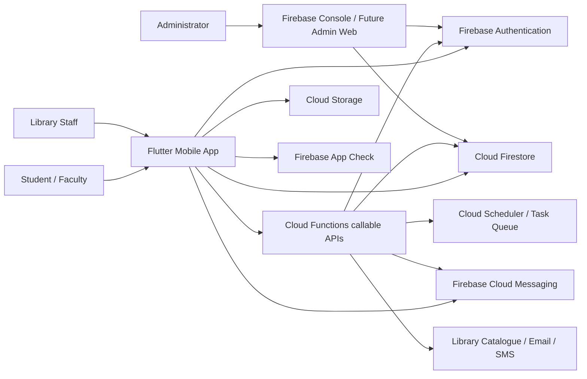
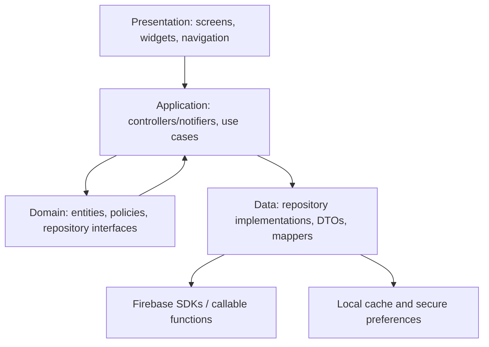

# Library+ High-Level Architecture

## 1. Architecture goals

The target is a production-ready Flutter client backed by Firebase. The mobile application owns presentation and local interaction state; Firebase Authentication establishes identity; Firestore stores operational data; Cloud Functions own privileged and transactional workflows; Cloud Messaging delivers push notifications; App Check reduces unauthorised API use.

The backend, not the device clock or client state, is authoritative for roles, inventory, reservation conflicts, expiry, QR validity, and audit records.

## 2. System context



## 3. Flutter application layers



Recommended feature-first layout:

```text
lib/
  app/
    app.dart
    router.dart
    bootstrap.dart
  core/
    config/ errors/ firebase/ logging/ navigation/ theme/ widgets/
  features/
    auth/
      data/ domain/ presentation/
    books/
    seats/
    reservations/
    waitlist/
    qr/
    notifications/
    profile/
    staff/
  l10n/
```

Keep feature boundaries, but split current screen-heavy files into presentation, domain, and data responsibilities. Use Riverpod (recommended) or retain `ChangeNotifier` only if the team can consistently handle async/loading/error states. Use `go_router` for declarative routes, guards, deep links, and role redirects.

## 4. Backend service boundaries

### Direct Firestore reads

Safe, query-oriented data may be read directly when rules can enforce access:

- Public/authenticated catalogue metadata.
- Seat/floor definitions and current derived status.
- The signed-in user's own reservations, waitlists, notifications, and preferences.
- Staff operational views only when staff claims are present.

### Callable Cloud Functions

All conflict-prone or privileged writes should use callable functions:

- `createBookReservation`
- `cancelBookReservation`
- `createSeatReservation`
- `cancelSeatReservation`
- `joinWaitlist`
- `claimWaitlistOffer`
- `verifyQrToken`
- `completeBookPickup`
- `checkInSeat`
- `checkOutSeat`
- `staffOverrideReservation`
- `bootstrapUserProfile`

Functions validate identity, role, policy, server time, resource state, and idempotency before committing a Firestore transaction.

### Background functions

- Expire uncollected books and missed seat check-ins.
- Promote waitlists and issue claim offers.
- Materialise occupancy counters.
- Send FCM/email/SMS notifications.
- Delete stale tokens and expired QR nonces.
- Reconcile catalogue data.
- Record audit and anomaly events.

## 5. Core data flows

### Google sign-in

1. Flutter starts Firebase and App Check.
2. User completes native Google sign-in.
3. Firebase Auth exchanges the Google ID token for a Firebase session.
4. `bootstrapUserProfile` validates institution policy and creates/updates `/users/{uid}`.
5. The app listens to ID-token changes and loads claims/profile.
6. Router redirects to student or staff shell.

### Seat reservation

1. User selects seat, date, and slot.
2. Client sends an idempotency key to `createSeatReservation`.
3. Function validates App Check/Auth, operating hours, limits, and overlap.
4. Firestore transaction checks the slot/resource and creates reservation atomically.
5. Function returns reservation and QR-display eligibility.
6. Background workflow schedules reminders and updates derived occupancy.

### QR verification

1. Student requests/displays a short-lived signed QR token.
2. Staff app scans using the camera.
3. Scanner sends token plus scanner location/device context to `verifyQrToken`.
4. Function validates signature, audience, reservation state, expiry, nonce, location, and replay.
5. Transaction records check-in/pickup and audit entry.
6. Staff app shows a server-returned result; it never decides validity locally.

### Waitlist promotion

1. Resource becomes available by cancellation, checkout, or expiry.
2. Background function selects the next eligible entry transactionally.
3. A time-limited offer is created and FCM notification sent.
4. User claims through callable function.
5. Unclaimed offer expires and promotion repeats.

## 6. Environment strategy

Maintain separate Firebase projects:

- `libraryplus-dev`
- `libraryplus-staging`
- `libraryplus-prod`

Use Flutter flavors and per-environment `firebase_options.dart`, package IDs, app names, icons, API endpoints, and App Check registrations. Never use production data in local tests. Emulator Suite is the default local backend.

## 7. Reliability and consistency

- Use Firestore transactions for inventory allocation and slot conflict checks.
- Use server timestamps for all policy decisions.
- Every mutation accepts an idempotency key.
- Store immutable event/audit IDs for sensitive actions.
- Prefer derived counters maintained by trusted functions; periodically reconcile them.
- Treat Firestore listeners as eventually consistent UI updates, not proof a privileged action succeeded.
- Display stale/offline state when data comes from cache.

## 8. Technology choices

- Flutter + Dart.
- Riverpod for testable async state (recommended).
- `go_router` for navigation and deep links.
- Firebase Auth + Google Sign-In.
- Cloud Firestore.
- Cloud Functions for Firebase (TypeScript).
- Firebase Cloud Messaging.
- Firebase App Check.
- Firebase Crashlytics, Analytics, Performance, Remote Config.
- `mobile_scanner` for QR camera scanning.
- `qr_flutter` for display.
- `flutter_secure_storage` only for app-specific secrets/preferences; Firebase tokens remain SDK-managed.
- `freezed`/`json_serializable` for immutable models and DTOs.

## 9. Migration from current prototype

1. Preserve screens and design tokens.
2. Introduce router, result/error types, repository interfaces, and environment config.
3. Wrap current `MockData` as fake repository implementations.
4. Build Firebase implementations feature by feature.
5. Replace `AppState` mutations with use cases/repositories.
6. Keep fakes for tests and demo mode.
7. Remove static counts and client-authoritative status.
8. Delete legacy/stale widget names and documentation after migration.

## 10. Architecture constraints

- No client can assign roles or write audit logs directly.
- No QR payload contains raw personal details.
- No direct client write may create a confirmed reservation.
- No UI feature is considered complete without rules/emulator tests.
- Analytics must not contain QR tokens, emails, student IDs, or free-text searches unless explicitly approved and anonymised.
